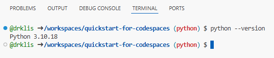
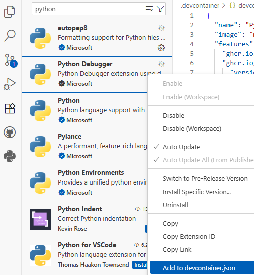

# Python for Codespaces
This tutorial combines a modification of [skills-dev/code-with-codespaces](https://github.com/skills-dev/code-with-codespaces) with an expense tracker developed by [drklis](https://github.com/drklis) using Claude AI. This project uses Python, including the matplotlib and pandas libraries, along with JavaScript (Express.js), but you don't have to actually know these programming languages in order to work with this tutorial and learn more about codespaces. It also includes some practice interacting with the terminal shell.

*Prerequisites:* You should have already completed the Haikus for Codespaces tutorial and have access to your repository with both `main` and `python` branches.

### Instructions

*Getting set up*
1. Navigate to your existing repository from the Haikus tutorial (the one you created last week, if you attended Tech Tacos, or just now).
2. Switch to the `python` branch. In your repository on GitHub, click the branch dropdown (currently showing "main") and select "python."
3. Create a new codespace on the python branch. Click the green "<> Code" button and then click "Create codespace on python." Wait for the Codespace to load and get set up -- this will take a few minutes as it installs Python and data visualization libraries!  **You should now have 2 tabs open: A) these instructions and B) the codespace itself.**
4. Test your Python environment. In the terminal, enter the following code and press enter `python --version`. You should see Python 3.10.x come up (where the x will be a number) as in the image below.
   
5. In the left navigation sidebar, open the "Explorer" tab (the one at the top that looks like two pieces of paper 📄). Click on `.devcontainer` which is a folder, and then click on `devcontainer.json`. Notice how the first line calls `"name": "Python 3.10 + Node.js",` as programming languages to be loaded into the codespace. In Step 4, we verified that we're running Python 3.10!
6. A little further down, you can see the customizations that have been loaded into the environment:
   ```json
   "customizations": {
    "vscode": {
      "extensions": [
        "ms-python.python"
      ]
    }
   },
   ```
   This means VS Code should automatically install the "Python" extension when the codespace is launched. Let's verify that! In the left navigation, select the "Extensions" tab (the one that looks like four building blocks where three are stable and one is diagonal ◻) and search for "python." Find entries for "Python" and "Python Debugger." Notice that the Python entry should already be installed, while the Python Debugger entry might not be. Right click on Python Debugger and select "Add to devcontainer.json" option.
   
   
   
   Did anything change in the previous code snippet? (*Hint*: `"ms-python.debugpy"` should have been added!)
8. 


## Additional Resources
- [Matplotlib Documentation](https://matplotlib.org/stable/tutorials/index.html)
- [Pandas Getting Started Guide](https://pandas.pydata.org/docs/getting_started/index.html)
- [Python Data Science Handbook](https://jakevdp.github.io/PythonDataScienceHandbook/)
